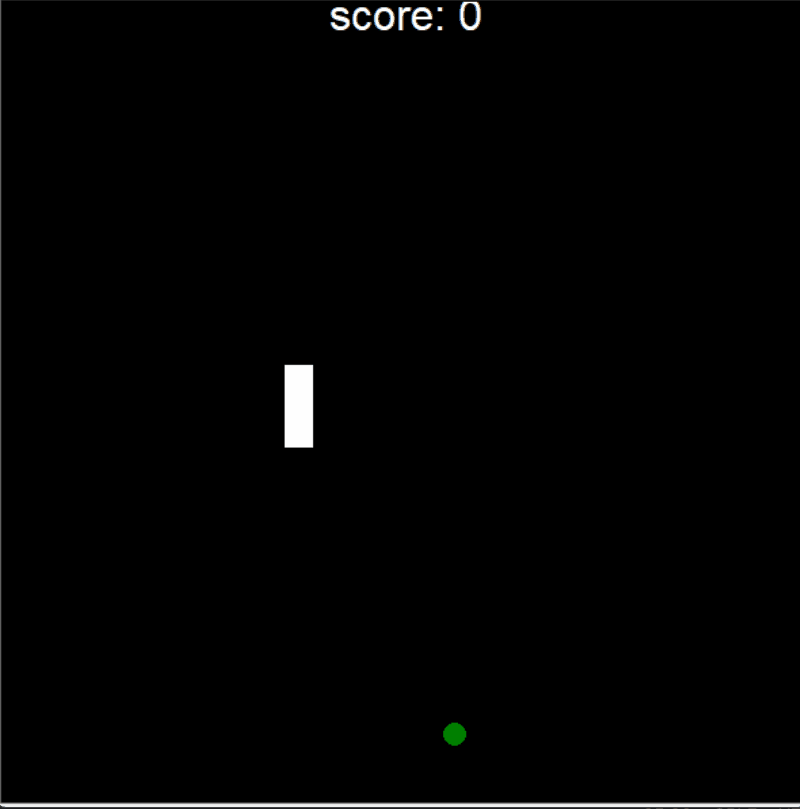

# Snake Game

A classic Snake Game built using Python Turtle Graphics and Object-Oriented Programming principles.

## Features

- Snake movement using arrow keys
- Food spawning at random positions
- Snake growth after eating food
- Live score tracking
- Wall collision detection
- Self-collision game over logic

## Project Structure

- `main.py` → Main game loop and collision handling
- `snake.py` → Snake creation, movement, and extension logic
- `food.py` → Random food generation
- `scoreboard.py` → Score display and game over message

## Technologies Used

- Python
- Turtle Graphics
- Object-Oriented Programming (OOP)

## Controls

- ↑ : Move Up
- ↓ : Move Down
- ← : Move Left
- → : Move Right

## Preview



## How to Run

```bash
python main.py
```
